<div align="center">
  
  
  # D2CPulse
  
  **AI-Powered Competitive Intelligence for D2C Brands**
  
  D2CPulse is an intelligent web application that provides comprehensive competitive analysis of Shopify-based D2C (Direct-to-Consumer) stores. Powered by AI and built with Next.js, it delivers actionable insights on pricing strategies, product positioning, and market analysis.
  
  
  
  
</div>

---

## ✨ Features

### 🤖 AI-Powered Analysis

- **Conversational Interface**: Natural language chat interface for store analysis
- **Real-time Streaming**: Instant AI responses with streaming support
- **Memory Retention**: Maintains conversation context across multiple queries

### 📊 Comprehensive Store Insights

- **Pricing Strategy Analysis**: Identifies luxury, premium, value, or penetration pricing
- **Product Distribution**: Analyzes budget, mid-range, premium, and luxury segments
- **Promotional Strategy**: Detects aggressive, selective, or premium no-discount approaches
- **Variant Analysis**: Evaluates product customization and options strategy
- **Catalog Positioning**: Determines niche specialist vs. broad generalist approach

### 🛍️ Shopify Store Intelligence

- Automatic product catalog fetching with pagination
- Collection and category analysis
- Pricing distribution and statistics
- Sale and discount detection
- Vendor and tag analysis

---

## 🚀 Getting Started

### Prerequisites

- **Node.js** 18.x or higher
- **pnpm** package manager
- Access to LiteLLM API endpoint (or compatible AI service)

### Installation

1. **Clone the repository**

   ```bash
   git clone <repository-url>
   cd d2cpulse
   ```

2. **Install dependencies**

   ```bash
   pnpm install
   ```

3. **Configure environment variables**

   Create a `.env.local` file in the root directory:

   ```env
   LITELLM_BASE_URL=your_litellm_endpoint
   LITELLM_API_KEY=your_api_key
   LITELLM_MODEL=claude-sonnet-4-5
   ```

4. **Run the development server**

   ```bash
   pnpm dev
   ```

5. **Open your browser**

   Navigate to [http://localhost:3000](http://localhost:3000)

---

## 💡 Usage

### Analyzing a Store

Simply type natural language queries in the chat interface:

```
Analyze boat-lifestyle.com
```

```
Compare gonoise.com and nike.com
```

```
What's the pricing strategy for allbirds.com?
```

### Example Prompts

- **Single Store Analysis**: "Analyze shopify-store.com"
- **Pricing Insights**: "What's the pricing strategy?"
- **Comparative Analysis**: "Compare these two stores"
- **Product Strategy**: "Tell me about their product range"

### Understanding the Analysis

The AI provides detailed reports including:

- **Overview**: Total products, collections, price range
- **Pricing Strategy**: Average/median prices, distribution, positioning
- **Product Strategy**: Variant options, catalog breadth
- **Strategic Insights**: Promotional approach, market positioning

---

## 🏗️ Architecture

### Tech Stack

- **Framework**: [Next.js 16](https://nextjs.org/) with App Router
- **Frontend**: React 19 with Client Components
- **AI Integration**: [@juspay/neurolink](https://www.npmjs.com/package/@juspay/neurolink)
- **API**: Next.js API Routes with streaming support
- **Styling**: CSS Modules

### Project Structure

```
d2cpulse/
├── src/
│   ├── app/
│   │   ├── api/
│   │   │   └── chat/
│   │   │       └── route.js      # AI chat endpoint with streaming
│   │   ├── layout.js              # Root layout
│   │   ├── page.js                # Main chat interface
│   │   └── globals.css            # Global styles
│   └── lib/
│       └── shopify-analyzer.js    # Shopify store analysis logic
├── public/                         # Static assets
├── .env.local                      # Environment configuration
└── package.json
```

### Key Components

#### `/api/chat` Endpoint

- Handles AI conversation with streaming responses
- Integrates Neurolink for LLM communication
- Automatically detects store URLs and triggers analysis
- Maintains conversation memory across requests

#### Shopify Analyzer (`/lib/shopify-analyzer.js`)

- Fetches products via Shopify's public API
- Handles pagination and rate limiting
- Calculates pricing statistics and distributions
- Generates strategic insights

#### Chat Interface (`/app/page.js`)

- Real-time message streaming
- Example prompt suggestions
- Responsive design with modern UI
- HTML rendering for formatted AI responses

---

## 🔧 Configuration

### Environment Variables

| Variable           | Description                                  | Required |
| ------------------ | -------------------------------------------- | -------- |
| `LITELLM_BASE_URL` | LiteLLM API endpoint URL                     | Yes      |
| `LITELLM_API_KEY`  | Authentication key for LiteLLM               | Yes      |
| `LITELLM_MODEL`    | AI model to use (default: claude-sonnet-4-5) | Yes      |

### Model Configuration

The application supports any model compatible with LiteLLM, including:

- Claude (Anthropic)
- GPT-4 (OpenAI)
- Custom models via LiteLLM proxy

---

## 📈 Features in Detail

### Pricing Strategy Detection

The analyzer categorizes stores into:

- **Luxury**: Average price > ₹16,000
- **Premium**: Average price > ₹12,000
- **Value**: Average price between ₹2,400-₹12,000
- **Penetration**: Average price < ₹2,400

### Price Distribution Analysis

Products are segmented into:

- **Budget**: < ₹4,000
- **Mid-Range**: ₹4,000 - ₹12,000
- **Premium**: ₹12,000 - ₹40,000
- **Luxury**: > ₹40,000

### Strategic Insights

- **Catalog Strategy**: Niche specialist vs. broad generalist
- **Pricing Consistency**: Spread analysis across product range
- **Promotional Strategy**: Discount frequency and intensity
- **Variant Strategy**: Customization and option complexity

---

## 🛠️ Development

### Build for Production

```bash
pnpm build
```

### Start Production Server

```bash
pnpm start
```

### Code Structure

- **API Routes**: Node.js runtime with dynamic rendering
- **Client Components**: Interactive UI with React hooks
- **Streaming**: Incremental response delivery for better UX
- **Error Handling**: Graceful degradation and user feedback

---

## 🤝 Contributing

Contributions are welcome! Please feel free to submit issues and pull requests.

---

## 📄 License

This project is private and proprietary.

---

## 🙏 Acknowledgments

- Built with [Neurolink](https://www.npmjs.com/package/@juspay/neurolink) by Juspay
- Powered by AI models via LiteLLM
- Shopify public API for store data

---

## 📞 Support

For questions or support, please contact the development team.

---

**Made with ❤️ for D2C competitive intelligence**
